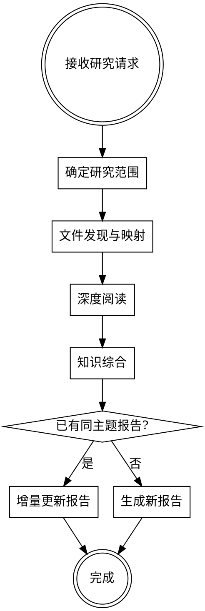

# 代码深度研究

深度研究代码库中的业务逻辑和实现细节，产出结构化中文研究报告到 `docs/research/`。

<HARD-RULE>
**绝对只读**：研究阶段绝对不能改动任何业务代码。只允许读取代码和写入研究报告（`docs/research/` 目录）。

违反此规则的合理化借口：
| 借口 | 现实 |
|------|------|
| "顺手修个小 bug" | 不行。只读。记录到风险点。 |
| "加个注释帮助理解" | 不行。只读。写在报告里。 |
| "重命名一下更清晰" | 不行。只读。在报告中说明。 |
| "格式化一下方便阅读" | 不行。只读。用 Read 工具原样阅读。 |
</HARD-RULE>

<HARD-RULE>
**代码即证据**：报告中的每个结论都必须能指向具体的代码位置（`file:line`）。无法从代码中直接确认的内容，必须标注 **[推测]** 并说明推测依据。绝不把推测当事实写。

研究报告是代码的忠实映射，不是产品文档。核心区分：
- **代码做了什么**（可观察事实）→ 直接写，附 `file:line`
- **代码为什么这样做**（因果推断）→ 必须标注 [推测]，除非代码注释/文档明确说明了原因

因果推断是最容易伪装成事实的推测。写出"这是因为..."或"为了避免..."时，问自己：**这个原因是代码注释写的，还是我推断的？** 如果是推断，就标 [推测]。

常见的推测陷阱：
| 陷阱 | 正确做法 |
|------|---------|
| "这个功能的业务价值是..." | 除非代码注释/文档明确说明，否则标注 [推测] |
| "这样设计是为了..." | 只描述代码做了什么，设计原因标注 [推测] 或省略 |
| "这是因为..." | 因果解释是推断，标注 [推测]，除非代码注释明确写了原因 |
| "为了避免..." / "防止..." | 归因动机是推断，标注 [推测]，除非有注释佐证 |
| "用户期望..." | 只描述代码实际产生的行为，不猜测用户期望 |
| "这个命名暗示..." | 基于命名的推断需标注 [推测] |
| "应该是用来..." | 描述代码实际被调用的方式，不猜用途 |
</HARD-RULE>

## 触发条件

**命令式**：用户说 "研究/分析/理解 X"、"/code-research \<area\>"

**自动触发**：接到功能迭代任务但对目标区域不熟悉时，先研究再开发

## 研究流程

### Phase 1: 确定研究范围

1. 接收用户输入：主题描述 + 种子文件（可选）
2. 如果用户只给了模糊描述没有文件，用 Grep/Glob 搜索相关关键词定位种子文件
3. 明确研究边界：这次研究要覆盖什么、不覆盖什么
4. 检查 `docs/research/` 下是否已有同主题报告，有则增量更新

### Phase 2: 文件发现与映射

从种子文件出发，构建完整的文件地图。用户可能只知道调用链中间的某个文件，需要双向追踪找到全貌。

**下游追踪**（这个文件依赖谁）：
- 读取文件的 import/require/include 等引用语句
- 递归跟进每个本项目内的依赖（忽略第三方库）

**上游追踪**（谁依赖这个文件）：
- Grep 搜索文件名、导出的函数名/类名/类型名
- 找到所有引用方

**横向搜索**（相关实体）：
- 同名或相关的类型定义、接口、数据模型
- 同前缀/同目录的相关文件
- 对应的测试文件
- 相关的配置文件、schema 定义

**收敛条件**：
- 每轮新发现的文件再做一次追踪，直到不再发现新的强相关文件
- 弱相关的记录但不展开
- 核心文件控制在合理范围内（通常不超过 15-20 个），超出时与用户确认是否继续扩展
- 建立文件地图表格（路径、职责、关键导出）

### Phase 3: 深度阅读

**关键原则：深度优先。宁可少覆盖几个文件，也要把每个文件读透。**

对文件地图中的每个核心文件：
1. 完整阅读文件，理解其职责
2. 追踪核心调用链：入口 → 中间处理 → 最终效果
3. 标记边界情况处理和特殊逻辑
4. 标记可疑/不确定之处（标为"待确认"）
5. 所有发现附带 `file:line` 引用
6. 用户视角还原：从用户角度理解每个流程
   - 用户触发这个流程时做了什么操作？
   - 系统给了用户什么反馈（成功/进行中/失败）？
   - 异常时用户会看到什么？

可使用 Explore 类型 subagent 并行阅读独立的文件组，指定 thoroughness 为 "very thorough"。

### Phase 4: 知识综合与报告生成

1. 梳理架构关系，画出依赖图（Mermaid 或文字）
2. 撰写功能概况（各能力的作用、范围、限制）
3. 撰写业务逻辑流程（每个流程先写业务说明，再写技术实现，带 `file:line` 引用）
4. 总结关键实现细节
5. 汇总潜在风险点（仅标记，不做深入 debug）
6. 整理术语表

**报告模板**：参照 [report-template.md](references/report-template.md)

**输出位置**：`docs/research/YYYY-MM-DD-<topic>.md`

## 效率指南

研究过程应高效利用 token，避免不必要的重复阅读和无限扩展：

- **先结构后细节**：对大文件，先快速浏览导出和函数签名，确认相关性后再深入阅读实现
- **并行阅读**：对独立的文件组，使用 Explore subagent 并行阅读，而非逐个串行
- **测试文件适度**：测试文件用于理解预期行为，但不需要逐行深读——关注 describe/it 描述和关键断言即可
- **避免重复搜索**：建立文件地图后基于地图工作，不要反复 Grep 已经定位过的内容
- **及时止步**：如果追踪到的依赖已超出研究主题边界，记录但不展开

## 关键约束

1. **绝对只读** — 不改动任何业务代码，只读取代码和写入报告
2. **代码即证据** — 所有结论必须有 `file:line` 引用，推测必须标注 [推测]
3. **深度优先** — 宁可少覆盖文件，也要把每个文件读透理解
4. **增量更新** — 如果已有同主题研究报告，更新而非重写
5. **边界收敛** — 文件发现过程有明确停止条件，避免无限扩展
6. **中文报告** — 报告用中文撰写，代码标识符保持原样
7. **业务可读** — 业务逻辑流程需包含自然语言的业务说明

## 常见错误

| 错误 | 正确做法 |
|------|---------|
| 只看入口文件就写报告 | 完整追踪调用链，深度阅读每个核心文件 |
| 研究过程中顺手改代码 | 绝对只读，发现问题记录到风险点 |
| 把推测当事实写进报告 | 无法用 `file:line` 证实的内容标注 [推测] |
| 文件发现无限扩展 | 区分强相关/弱相关，弱相关只记录不展开 |
| 报告没有代码引用 | 每个结论都附 `file:line` 引用 |
| 只描述代码做了什么，不说业务含义 | 每个流程先写业务说明（用户做了什么、系统做了什么），再跟技术实现 |
| 对大文件逐行阅读 | 先看结构（导出、签名），确认相关性后再深入 |
