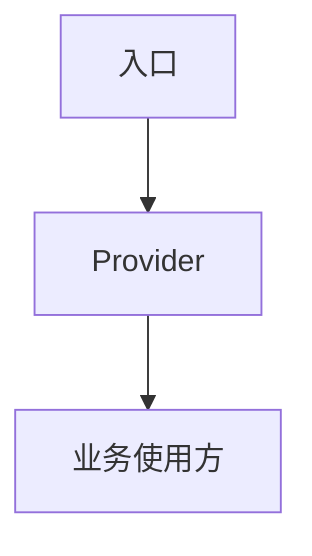

# [研究主题]

<!-- 成稿时删除写作提示，替换占位符，按内容裁剪章节并连续编号。读者背景只影响解释深度，不作为表头或对读者的称呼。 -->

> 研究模式: 独立研究 / 实现前预研 / 接手-warm-up
> 研究日期: YYYY-MM-DD
> 报告身份: `report_id = [seed]::[topic-slug]::[scope-slug]`
> 源码基线: [commit 或分支；如工作区有改动请注明]
> 研究范围: [覆盖的模块、入口和边界]
> 排除项: [明确不展开的区域]
> 种子文件: [用户提供或搜索得到的起点]
> 证据限制: [没有则写“无”]

## 证据索引

正文使用短标签和行范围，例如 `Provider:21-64`。本表必须把标签映射到完整仓库相对路径。

| 标签 | 文件路径 | 用途 |
|---|---|---|
| `Provider` | `path/to/Provider.tsx` | 核心实现 |
| `README` | `path/to/README.md` | 产品或架构背景 |

## 写作版式（所有模式适用）

- 每段只表达一个主要判断，尽量使用一到三句短句。
- 并列事实使用列表或表格。避免连续分号、长串括号和密集长段落。
- 多文件链路使用 Mermaid 或 ASCII 图。图后只解释关键关系，不复制整张图。
- 正文使用证据短标签和行范围。完整路径集中在证据索引中。
- 先给结论和范围，再给实现细节，最后给未验证项和限制。

## 0. 产品导览（接手/warm-up 必填）

接手/warm-up 报告使用下面各节作为产品地图。其他报告从 `## 1. 结论摘要` 开始。

### 0.1 概述：它在产品中的角色

先用非研发语言说明这个模块为什么存在、属于哪个产品或业务区域，以及它负责什么。

**证据**：`README:1-3`、`Provider:21-64`

### 0.2 用户和产品能看到什么

用短句或列表说明用户、操作方或下游产品能看到的入口、结果、状态和限制。没有直接 UI 时，说明外部系统或调用方能观察到什么。

- [可见结果或限制]。
  **证据**：`业务使用方:20-35`

### 0.3 页面与能力清单

| 页面/入口 | 使用者目标 | 可见能力或限制 | 证据 |
|---|---|---|---|
| [页面或入口] | [使用目标] | [主要能力或限制] | `业务使用方:8-19` |

如果研究对象是基础设施而不是页面，改为“下游能力/调用入口清单”。

### 0.4 主要操作与限制

按页面或流程分组展开“动作 → 条件 → 可见结果”，执行 SKILL.md 中的业务完整性要求。短段落或小表格均可，避免把全部操作压进一行。

#### [页面或流程名称]

[本组动作的共同使用条件，只解释一次。]

| 动作 | 使用条件或限制 | 可见结果 | 证据 |
|---|---|---|---|
| [具体动作] | [权限、状态或类型差异] | [导航、弹窗、禁用、提示等源码可确认结果] | `业务使用方:20-35` |

[未读到的反馈与下一步验证。区分源码确认的界面行为和实际运行结果。]

## 1. 结论摘要

用一到三段短句说明研究问题的答案。不要把实现细节、限制和所有证据都塞进摘要。

## 2. 研究范围与文件地图

| 文件 | 职责 | 关键入口或符号 |
|---|---|---|
| `path/to/file.ts` | ... | `functionA` |

## 3. 直接调用链与架构

warm-up 或三层以上跨文件链路必须提供 Mermaid 或 ASCII 图。每个节点都要能在文件地图或证据索引中定位。

图后用短段落解释入口、主要上下文和最终效果。不要把图中全部关系再复制成长段落。

## 4. 已确认行为与边界

### [行为或流程名称]

**观察到的行为**：一段只表达一个判断的短文。

**关键步骤**：

1. [步骤]。**证据**：`Provider:42-51`
2. [分支、边界或副作用]。**证据**：`Utils:3-13`

## 5. 未验证项

| 项目 | 类型 | 证据或缺口 | 影响 | 建议验证 |
|---|---|---|---|---|
| ... | 未验证/推断/已观察风险 | `Provider:line` 或说明缺口 | ... | ... |

## 6. 术语表（按需保留）

| 术语 | 含义 | 证据 |
|---|---|---|
| `Network Island` | ... | `README:1-3` |

## 7. 研究限制

用短句说明没有读取哪些文件、没有执行哪些运行时验证，以及这些限制对结论的影响。

## 8. 更新记录（增量报告必填）

| 日期 | 旧基线 | 新基线 | 范围变化 | 结论变化 |
|---|---|---|---|---|
| YYYY-MM-DD | `old-commit` | `new-commit` | 无 / ... | 未变化：...；已变化：...；已失效：...；新增：...；仍未验证：... |

### Claim ledger（增量报告必填）

| claim_id | 结论摘要 | 状态 | 旧证据 | 新证据 | 变化原因 |
|---|---|---|---|---|---|
| C1 | ... | 未变化/已变化/已失效/新增/仍未验证 | `path:line` 或不适用 | `path:line` 或不适用 | ... |
