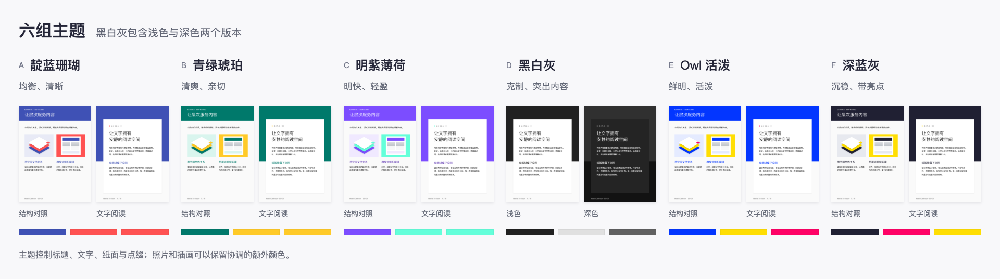
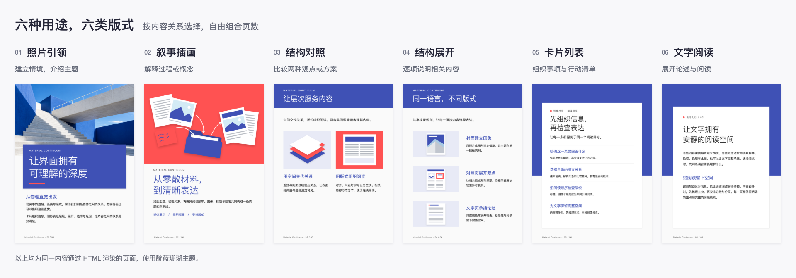

# Material Continuum

用于活动介绍、产品说明、服务对照和观点文章的图文排版 skill。以 Material Design 的色块、纸面层次与字体层级组织内容，生成可编辑的独立 HTML 和可分享的 PNG 图片。

提供六类版式与六组主题，支持 3:4、1:1、16:9 图片和响应式网页。默认图片尺寸为 1080 × 1440，页数由内容决定。

## 主题速览



黑白灰提供浅色与深色两个版本，共七个可选 theme 值。

| 主题 | theme | 选择建议 |
|---|---|---|
| 靛蓝珊瑚 | `A` | 默认选择。兼顾清晰、稳重与活力，适合图文均衡的作品。 |
| 青绿琥珀 | `B-bright` | 想呈现清爽、亲切的气质时使用，适合生活、服务与社区类内容。 |
| 明紫薄荷 | `C-bright` | 想要明快而有辨识度，适合文化、阅读和创意类内容。 |
| 黑白灰 | `D-light` / `D-dark` | 希望照片与文字成为焦点时使用；浅色偏阅读，深色偏沉浸式展示。 |
| Owl 活泼 | `E-owl` | 需要鲜明、活泼的视觉印象时使用，适合短内容、课程介绍与推广。 |
| 深蓝灰 | `F-slate` | 希望稳重底色搭配少量亮点时使用，适合有照片或精炼图示的专题。 |

这些是视觉气质建议，不是题材限制。先确定希望呈现的气质，再把主题放到照片、插画和整套页面中检查。连续作品保持同一主题；阅读区保留中性底色，强调色用于少量标题、短语或标记。颜色角色的分工参考 [Material Design](https://m2.material.io/design/introduction/)。

## 版式速览



| 想让读者做什么 | 版式 | layout |
|---|---|---|
| 进入场景、认识主题 | 照片引领 | `photo-led` |
| 理解一个过程或概念 | 叙事插画 | `narrative` |
| 比较两种观点或方案 | 结构对照 | `comparison` |
| 逐项了解相关内容 | 结构展开 | `sections` |
| 浏览事项或采取行动 | 卡片列表 | `list` |
| 连续阅读与理解论述 | 文字阅读 | `reading` |

按内容关系选择和组合版式。配色控制文字、纸面和点缀；位图保持自己的颜色，黑白灰主题也可使用彩色照片。需要随主题变化的概念配图可用 SVG。

## 目录

```text
material-continuum/
├── SKILL.md              Agent 制作与校对流程
├── README.md             使用和维护入口
├── DESIGN.md             视觉规则、基础设计值
├── BRIEF.md              内容 JSON 格式
├── assets/               配色、版式、图标库、参照与速览图
├── scripts/              渲染、校验、导出、图标与设计同步
├── tests/                对应的行为与回归测试
├── package.json
├── package-lock.json
└── .gitignore
```

生成的作品与本地检查记录放在仓库根目录的 `scratch/`，该目录不纳入版本控制。依赖与下载图标缓存也不提交。

## 使用

让 Agent 使用本目录的 `SKILL.md`，提供原文、用途、画幅、主题和已有图片。例如：

> 使用 Material Continuum，把这份活动材料做成一套 3:4 图文简报。使用明紫薄荷，按内容选择页数，交付 HTML、PNG 和校对结论。

首次使用，在 skill 根目录安装运行依赖：

```bash
npm ci
npx playwright install chromium
```

也可使用已有 Chrome，将 `MC_CHROMIUM_PATH` 指向其可执行文件。首次导出要确认浏览器能正常启动。

按照 [BRIEF.md](BRIEF.md) 准备 `brief.json` 与同目录下的图片后：

```bash
node scripts/render-brief.mjs /path/to/work/brief.json --out /path/to/work/output.html
node scripts/validate-brief.mjs /path/to/work/output.html --report /path/to/work/validation.json
node scripts/export-pages.mjs /path/to/work/output.html --out /path/to/work/png
```

导出文件为 `01.png`、`02.png`……，同时生成顺序清单和检测报告。验证器会区分结构、实际渲染、来源语义和视觉检查；`review_required` 表示仍需要人工式内容/视觉复核，不等于渲染失败。

网页模式：渲染加 `--mode web`，验证和导出加 `--web`。固定画幅用 `--ratio 1:1` 或 `--ratio 16:9`；PNG 导出宽高对应使用1080×1080或1920×1080。渲染、校验、导出和图标脚本提供 `--help`；设计同步使用 npm 脚本。

## 图标

使用经典 Material Icons Filled；完整索引、常用别名和内置 SVG 位于 `assets/icon-library.json`。按需获取更多图标：

```bash
node scripts/material-icons.mjs search 环保
node scripts/material-icons.mjs fetch recycling
node scripts/material-icons.mjs fetch recycling --offline
```

下载缓存位于 `.cache/icons/`，可用 `--cache-dir` 指定其他目录。默认缓存中的图标可被 renderer 直接使用；外部缓存的 SVG 作为 brief 的 image 素材使用。工具校验 SVG、来源和哈希；离线缺图会明确失败，不使用近似图标替代。图标原许可保留在 `assets/icon-library.json` 的 `licenseText`，生成 HTML 内也包含所使用图标的许可说明。

## 维护

- 修改文字和图片：改作品的 brief / assets，重新渲染。
- 修改配色：改 `assets/color-themes.json`，运行 `npm run themes:sync` 和 `npm run themes:check`。
- 修改基础设计值：改 DESIGN.md frontmatter，运行 `npm run design:sync` 和 `npm run design:check`。
- 新增版式：按 DESIGN.md 同步修改渲染、版式契约和 CSS，使用实际内容与 PNG 验证。

```bash
npm test
npm run design:check
npm run themes:check
```

测试在临时目录创建所需素材。完整浏览器测试需要可用 Chromium/Chrome；部分几何测试通过 `MC_CHROMIUM_PATH` 指定浏览器后执行。代码沿用仓库 MIT 许可；Material Icons 保留自身 Apache 2.0 许可。
