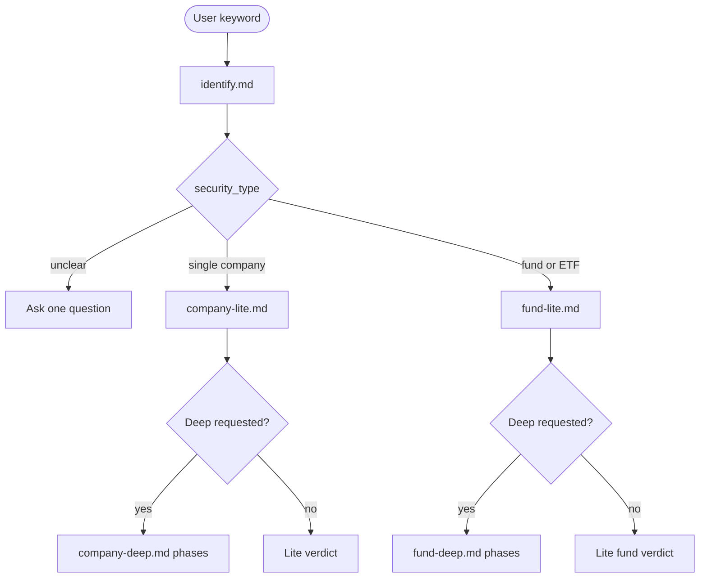

# Chatbot 使用指南

这套 prompt 面向没有工具、没有联网或金融数据能力有限的 Chatbot。不要要求无工具模型一次性完成完整审计；应分阶段运行。

## 通用流程

1. 使用 `chatbot/system.md` 固定纪律。
2. 使用 `chatbot/identify.md` 先确认证券类型。
3. 若为个股，默认使用 `chatbot/company-lite.md`。
4. 若为 ETF / 基金，默认使用 `chatbot/fund-lite.md`。
5. Deep 路径使用 `company-deep.md` 或 `fund-deep.md`，但一次只运行一个 Phase。

## 个股 Lite

推荐顺序：

```text
system.md
identify.md
company-lite.md
```

## 个股 Deep

`company-deep.md` 内含 5 个 Phase：

1. Data Intake and Identity
2. Cross-Cycle Financial Audit
3. Business Quality, Archetype, Moat, and Hidden Upside
4. Valuation and Opportunity Cost
5. Classification, Red Team, and Final Verdict

每个 Phase 完成后再进入下一 Phase。若模型提示数据不足，先补数据，不要让它继续生成裁决。

## Fund Lite

推荐顺序：

```text
system.md
identify.md
fund-lite.md
```

## Fund Deep

`fund-deep.md` 内含 4 个 Phase：

1. Data, Wrapper, and Methodology
2. Portfolio Anatomy and Growth Attribution
3. Exposure-Level Checks and Misunderstanding Audit
4. Red Team, Portfolio Role, and Final Verdict

基金默认只分析基金作为工具，不自动展开底层单股。只有用户明确要求分析某个重仓股时，才另行使用个股 workflow。

## 决策路径



## 常见错误

- 在身份不明确时直接分析
- 无数据时编造估值
- 把 ETF 当公司填财务报表字段
- 用单一持仓增速代表基金组合增速
- 在 Deep 个股里跳过 M/N 投资类型判定
- 没有 peer fund comparison 却给基金积极裁决
- 没有 `Structured Summary`
